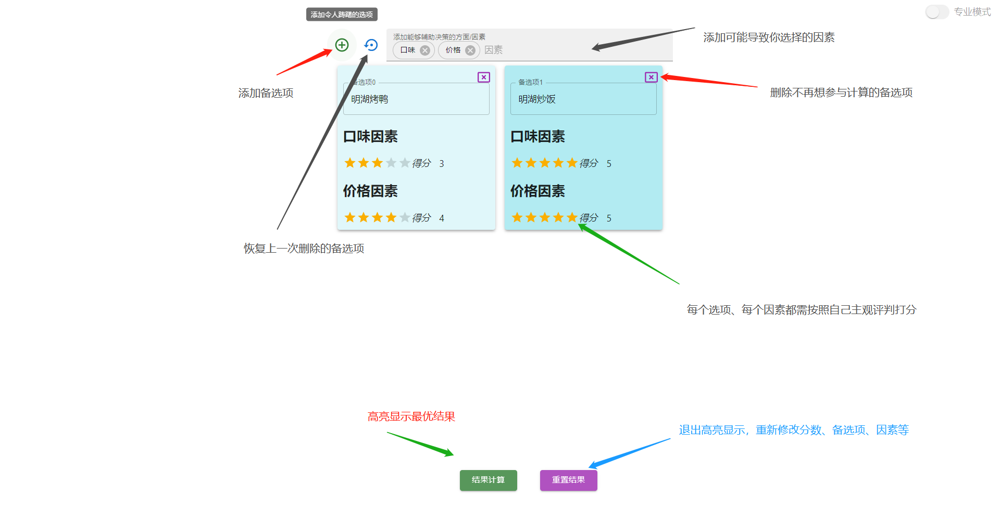

# 犹豫终结者

:trollface: 犹豫终结者是一个web应用，旨在解决掉用户的选择困难症

## 在线使用
https://giorgiopeng.github.io/Hesitation-Terminator/

## 原理
1. 使用用户的先验数据，量化以便衡量每个因素的重要性
2. 在同样得分下，相信用户最先添加进来的备选项是最优的（不然凭啥最先添加进来）

## 能够做什么
本项目能够做**任何**决策  

小到今天有很多好吃的，要吃什么   
> 常见因素：
> - 好吃程度
> - 价格理想程度
> - 出餐用时
> - 餐馆位置远近程度
> - 。。。  

大到人生重大决策，比如高考选校
> 常见因素
> - 能被录取的可能程度
> - 饮食适应程度
> - 师资
> - 气候环境
> - 生活幸福指数
> - 。。。

**:trollface:做出选择后悔了概不负责啊**  

理论上来说，当你的先验知识越加丰富，做出的选择越加接近最优解, 究其根本，该应用仅仅只是一种因素辅助量化手段。  

## 如何使用
这里以在北交的明湖食堂吃什么为例。。。    

## TODO
- [x] 快速模式（快速的做出最优判断）  
- [ ] 专业模式（可以自定义每个因素的权重）
